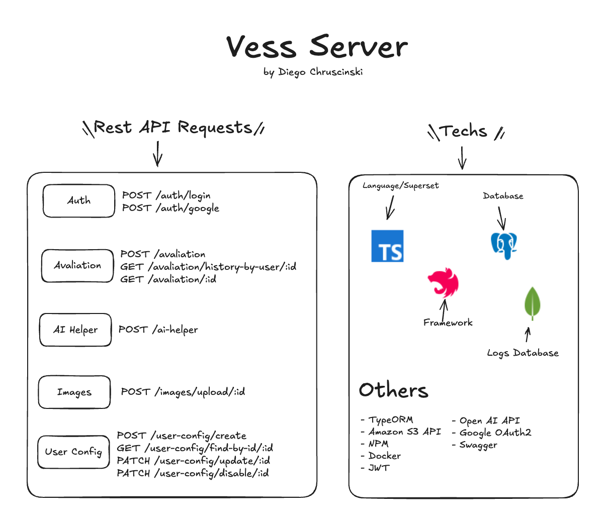

# VESS-SERVER 🚀

## 📖 About

**VESS-SERVER** is an API built with [NestJS](https://nestjs.com) for the **Advanced Web Programming** course at UTFPR.  
Its main goal is to manage the registrations and operations required to calculate the **VESS method**, providing REST endpoints, secure authentication, and integrations with external services.

---

## Overview

  

---

## ✨ Tech stack

- **Framework:** NestJS
- **Language:** TypeScript
- **Databases:** MongoDB and PostgreSQL
- **API Documentation:** Swagger (OpenAPI)
- **Integrations:**
  - OpenAI (ChatGPT)
  - Amazon S3 (file uploads)
- **Authentication:** JWT Bearer Token + Google OAuth2
- **CI/CD:** GitHub Actions

---

## 🚀 Key features

- User registration and authentication (**JWT + Google OAuth2**)
- VESS method resources management (CRUD and business rules)
- File upload and management via **Amazon S3**
- **OpenAI** integration to assist with AI-generated descriptions
- Auto-generated API docs with **Swagger**
- CI/CD pipelines with **GitHub Actions**

---

_Developed by Diego Chruscinski de Souza for the Advanced Web Programming course at UTFPR._
